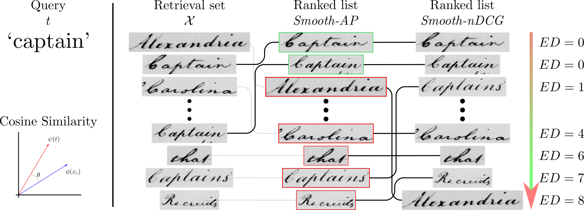

# Learning to Rank Words: Optimizing Ranking Metrics for Word Spotting

<p align="center">

</p>

## Introduction

## Installation

```bash
git clone https://github.com/priba/ndcg_wordspotting.pytorch.git
cd ndcg_wordspotting.pytorch
conda env install -f environment.yml
conda activate ndcgws
```

## Train

```bash
python main.py --data_path /path/to/GeorgeWashington/
```

## Test

```bash
python main.py --data_path /path/to/GeorgeWashington/ -t -l
/path/to/trained/weights/
```

## Data

### [George Washington](http://ciir.cs.umass.edu/downloads/old/data_sets.html)

###
[IIIT5K](https://cvit.iiit.ac.in/research/projects/cvit-projects/the-iiit-5k-word-dataset)

## Citation

```
@inproceedings{riba2021sndcg,
    author = {Riba, Pau and Molina, Adrià and Gomez, Lluis, and Ramos-Terrades,
    Oriol and Lladós, Josep},
    title = {Learning to Rank Words: Optimizing Ranking Metrics for Word Spotting},
    booktitle = {Proceedings of the International Conference on Document Analysis and Recognition (ICDAR)},
    year = {2021}
}
```
